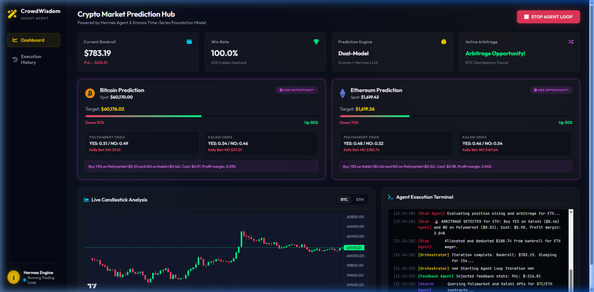
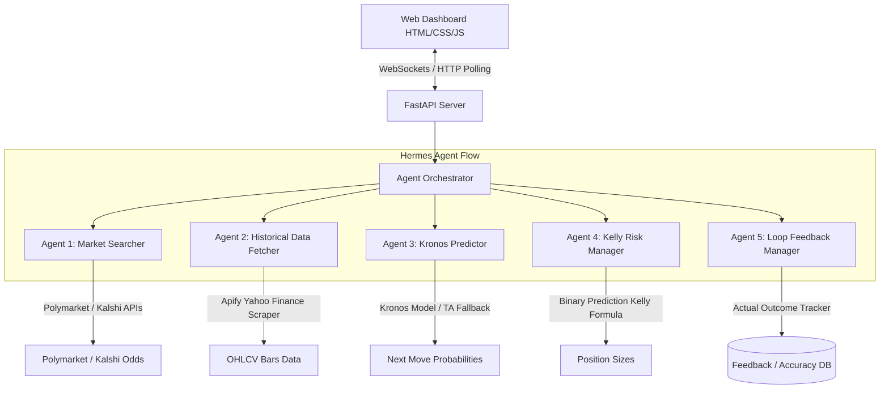

# CrowdWisdomTrading Predictions CRYPTO Agent

An autonomous multi-agent quantitative prediction, risk management, and arbitrage system built using the **Hermes Agent framework**. The platform continuously analyzes BTC and ETH markets, scrapes price data, forecasts short-term movements, sizes wagers using the Kelly Criterion, resolves trades in an SQLite loop, and displays execution details on a premium web dashboard.



---

## System Architecture & Agent Flow

The system orchestrates five specialized agents in a continuous loop:



### 1. Market Search Agent (`agents/search_agent.py`)
- Searches **Polymarket** (Gamma API) and **Kalshi** (Trade API) for active BTC/ETH short-term up/down prediction contracts.
- **Robust Fallback:** If Polymarket/Kalshi APIs are geoblocked or time out, it queries the public **Binance API** to retrieve real-time spot rates and generates realistic market spreads and contract odds (YES/NO contract pricing) dynamically.

### 2. Historical Data Scraper Agent (`agents/data_agent.py`)
- Triggers the **Apify Yahoo Finance Scraper** (`parseforge/yahoo-finance-scraper`) to scrape the last 1000 bars of 1-minute historical candlestick data for BTC and ETH.
- **Robust Fallback:** If Apify API usage limits are reached or credentials are missing, it falls back to a direct, fast download of OHLCV candles from the public **Binance API** endpoint.

### 3. Price Predictor Agent (`agents/predictor_agent.py`)
- Prepares the **Kronos** foundation model architecture (`NeoQuasar/Kronos-small` + `NeoQuasar/Kronos-Tokenizer-base`) using PyTorch and Transformers.
- **Robust Fallback:** Calculates technical indicators (MACD, RSI, Bollinger Bands) and uses a programmatic **Hermes Agent** via OpenRouter to analyze the market context and output a direction probability ($P_{\text{model}}$). If offline, it uses a fallback momentum trend-matching math model.

### 4. Kelly Criterion Risk Agent (`agents/risk_agent.py`)
- Implements the **Kelly Criterion** customized for binary prediction markets:
  - If model probability $p$ is greater than YES contract price $m$ ($p > m$): Buy YES contracts with a raw fraction:
    $$f^* = \frac{p - m}{1 - m}$$
  - If model probability $p$ is less than YES contract price $m$ ($p < m$): Buy NO contracts (price is $1 - m$) with a raw fraction:
    $$f^* = \frac{m - p}{m}$$
  - Applies a fractional Kelly scaling multiplier (default: `0.5` for Half-Kelly) and a max allocation limit (`25%`) to avoid the risk of bankroll ruin.
- **Arbitrage Detection:** Scans for price discrepancies between Polymarket and Kalshi. If $P_{\text{Polymarket YES}} < P_{\text{Kalshi YES}}$, it wagers YES on Polymarket and NO on Kalshi, locking in a risk-free margin of $P_{\text{Kalshi YES}} - P_{\text{Polymarket YES}}$.

### 5. Loop Feedback Agent (`agents/feedback_agent.py`)
- Logs predictions and wagers to a local **SQLite database** (`data/feedback.db`).
- Tracks trades and resolves them against actual Binance spot prices at contract expiry.
- Computes lifetime win rates and PnL, generating a feedback prompt that adapts future Kelly sizing (e.g., scaling up to `0.7` on high win-streaks or dropping to `0.25` during drawdowns) to self-optimize the loop.

---

## Premium Visual Dashboard

Served by a **FastAPI** backend, the dashboard features:
- **State Controls:** Start/Stop the background agent loop and configure intervals.
- **Vibrant Gauges:** Real-time visual meters showing model predictions, targets, and contract prices.
- **Interactive Price Charting:** Renders recent candlestick histories dynamically using TradingView's **Lightweight Charts** library.
- **Execution Terminal:** Displays a scrollable command log with color-coded tags mapped to each agent.
- **Auto-polling Fallback:** Instantly establishes WebSocket state synchronization, falling back to clean HTTP polling if WebSockets are restricted by the client sandbox or network.

---

## Installation & Getting Started

### 1. Prerequisites
Ensure you have Python 3.11+ installed. Clone the repository and install the dependencies:

```bash
pip install -r requirements.txt
```

### 2. Environment Setup
Rename `.env.example` to `.env` and fill in your credentials:

```env
# OpenRouter API Key (Required for Hermes LLM predictions)
OPENROUTER_API_KEY=sk-or-v1-your_openrouter_api_key

# Apify Token (Optional: falls back to Binance API if empty or limit exceeded)
APIFY_TOKEN=apify_api_your_token

# Risk Settings
BANKROLL=1000.0
KELLY_FRACTION=0.5
TRADING_LOOP_INTERVAL=15
DEFAULT_MODEL=meta-llama/llama-3-8b-instruct:free
```

### 3. Run the System

You can run the FastAPI orchestrator directly:

```bash
python main.py
```

*On Windows, you can simply double-click the `run.bat` file in the root directory to launch the server immediately.*

Open your browser and navigate to:
```
http://127.0.0.1:8000
```
Click **START AGENT LOOP** on the dashboard to activate the agents.

---

## Project Structure

```
hermes-crypto-prediction-agent/
├── agents/
│   ├── search_agent.py      # Polymarket & Kalshi scrapers
│   ├── data_agent.py        # Apify OHLCV data fetcher
│   ├── predictor_agent.py   # Kronos / TA predictor
│   ├── risk_agent.py        # Kelly position sizer & arbitrage
│   └── feedback_agent.py    # SQLite database trade resolution
├── static/
│   ├── index.html           # Dashboard HTML layout
│   ├── style.css            # Vanilla CSS styling
│   ├── app.js               # UI controller and socket polling
│   └── dashboard_screenshot.png # UI visual asset
├── config.py                # Environment configs loader
├── main.py                  # FastAPI orchestrator server
├── requirements.txt         # Package dependencies
└── run.bat                  # Windows startup script
```
